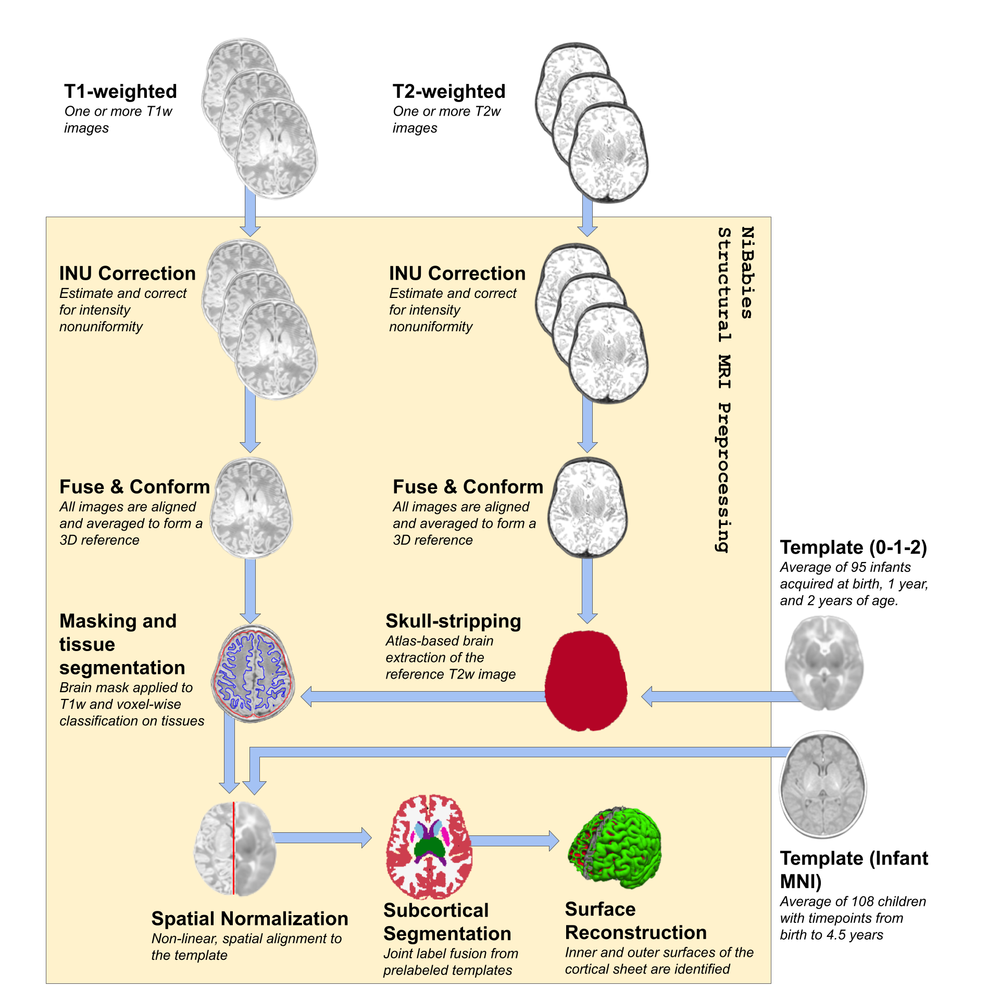
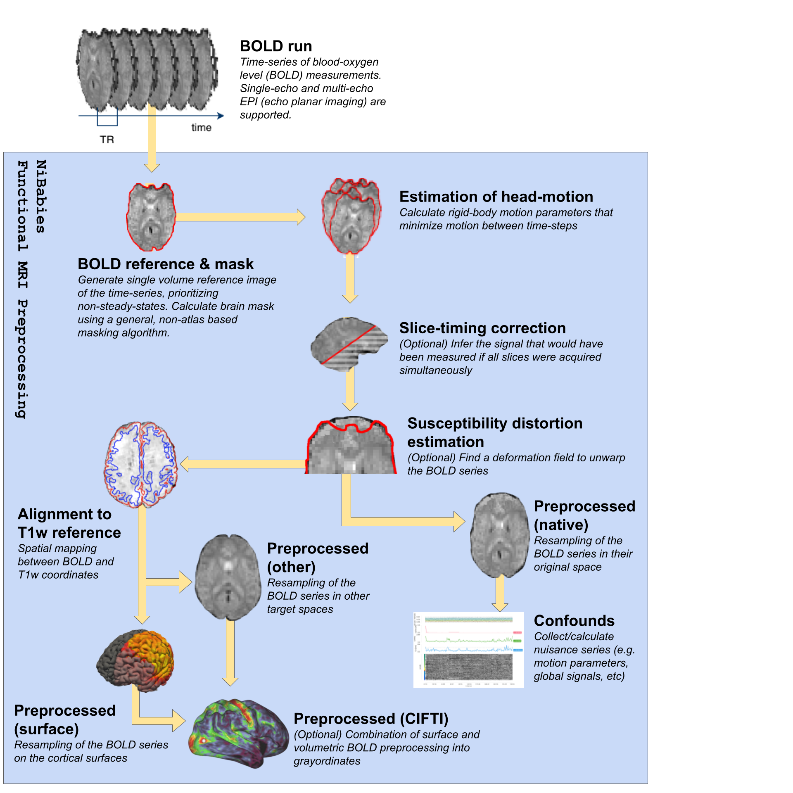

# *NiBabies*: A robust preprocessing workflow tailored for neonate and infant MRI


[](https://zenodo.org/badge/latestdoi/264223087)

Anatomical | Functional
---------- | ----------
 | 

*NiBabies* is an extension of [fMRIPrep](https://fmriprep.org/en/stable/) designed and tested for infants 0-2 years old. *NiBabies* offers structural and functional MRI preprocessing.

---

## Getting Started

Before using *NiBabies*, you will need to have your MRI data formatted in [BIDS](https://bids.neuroimaging.io/).
This helps the software locate the available data, and optimize the workflow accordingly.

### Installing NiBabies

Given its extensive dependencies, the easiest way to get up and running with *NiBabies* is by using the available [Docker](https://hub.docker.com/r/nipreps/nibabies/tags?page=1&ordering=last_updated) containers.

Images are all tagged with the release number, which must be specified in order to pull the images. For example, if you wanted to pull version `21.0.0rc1`, you would use the following command.
```
# Docker
docker pull nipreps/nibabies:21.0.0rc1
```

However, if you would prefer to install this tool natively, you can refer the [Dockerfile](./Dockerfile) as a guide for all the dependencies.

---

## Usage

*NiBabies* follow the [BIDS App Specifications](http://bids-apps.neuroimaging.io/about/), meaning you only need to provide three positional arguments:

- **bids_dir** - the root folder of a BIDS valid dataset.
- **output_dir** - folder to store outputs and reports.
- **level** - processing stage to be run, currently can only be `participant`.

However, as infant brains can vastly differ depending on age, providing the following arguments is highly recommended:

- **--age-months** - participant age in months
> **_NOTE:_** This is required when using Infant FreeSurfer
- **--segmentation-atlases-dir** - directory containing pre-labeled segmentations to use for Joint Label Fusion.

> **_NOTE:_** The segmentation directory should consist of one or more template directories containing:
> - A segmented and labelled NIfTI that includes `Segmentation` in the filename.
> - A brainmasked T1w NIfTI that includes `T1w` in the filename.

To view all options, see the [Command-Line Arguments](https://nibabies.readthedocs.io/usage.html#command-line-arguments) section of the documentation.

---

## Running with ``nibabies-wrapper``

The ``nibabies-wrapper`` is a lightweight Python 2/3 wrapper for running *NiBabies* via Docker and Singularity.
It will generate a Docker/Singularity command line for you, print it out for reporting purposes, and then execute it without further action needed, e.g.:


### Docker
```
$ nibabies-wrapper docker /path/to/data /path/to/output participant --age-months 12

RUNNING: docker run --rm -e DOCKER_VERSION_8395080871=20.10.6 -it -v /path/to/data:/data:ro \
-v /path/to/output:/out nipreps/nibabies:21.0.0rc1 /data /out participant --age-months 12
```

### Singularity
```
$ nibabies-wrapper singularity /path/to/data /path/to/output participant --age-months 12 -i nibabies-21.0.0rc1.sif

RUNNING: singularity run --cleanenv -B /path/to/data:/data:ro \
-B /path/to/output:/out nibabies-21.0.0rc1.sif /data /out participant --age-months 12
```
Note that the `-i` flag is required when using Singularity, and should be the path to the already built Singularity image file.

The ``nibabies-wrapper`` accepts all of the [available options for NiBabies](#usage), automatically translating local files and directories into mount points.

---

## Outputs

TODO - Refer to [fMRIPrep's outputs](https://fmriprep.org/en/20.2.1/outputs.html) for now.
